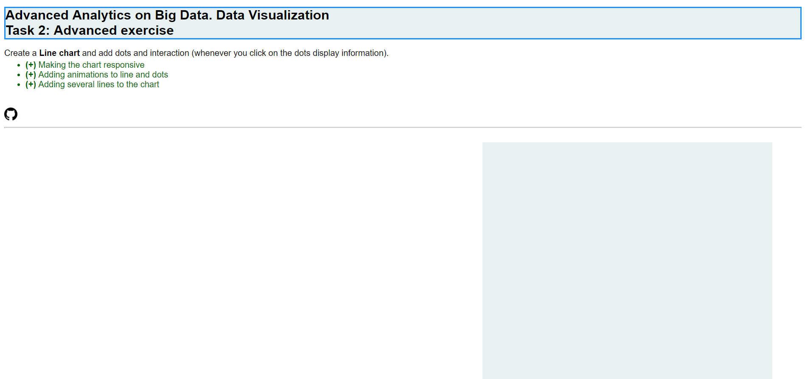
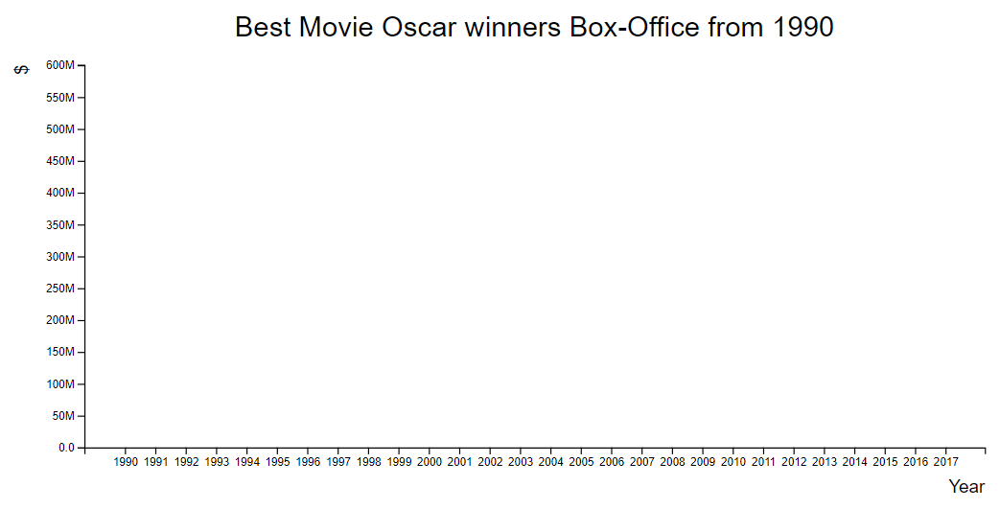
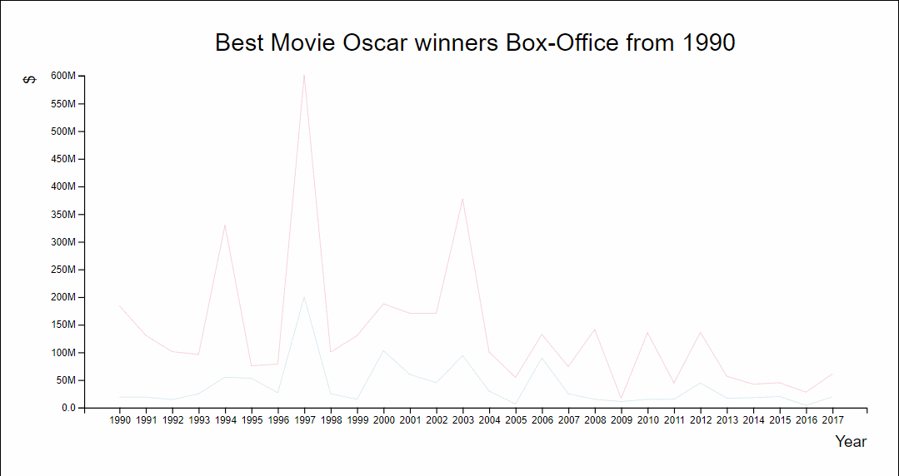
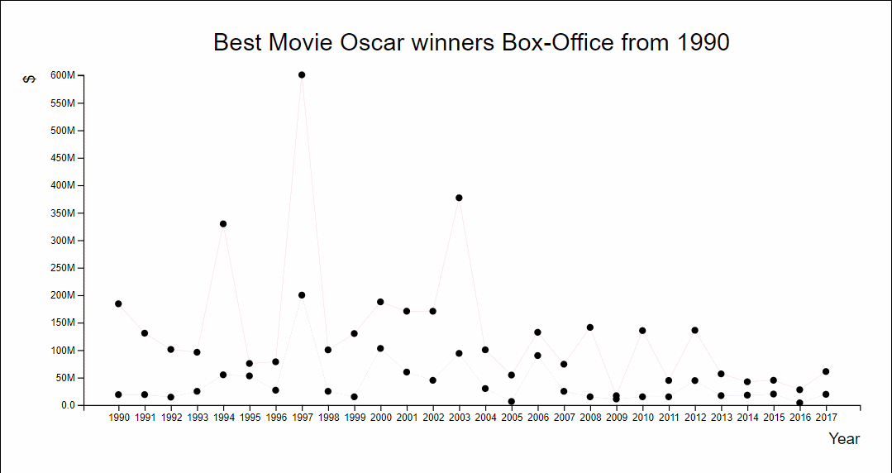
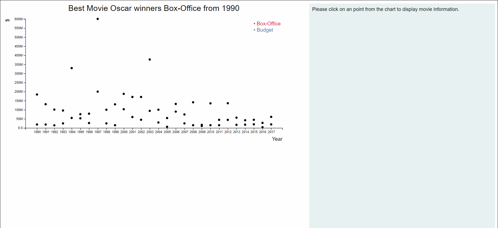

# D3js_AdvancedTask_MasterBigData
Second task for Data Visualization module from master "Advanced Analytics on Big Data"

This task consists on displaying a **Line chart** and adding dots and interaction (whenever you click on the dots display information).

Additionally, more features were included, just for learning:
- Making the chart responsive
- Adding animations to line and dots
- Adding several lines to the chart

Below there is an explanation on how to run and reproduce the example.

## Usage
Please follow these steps to visualize the exercise:
1. Move to any desired folder: ``cd <path>``.
2. Clone there git repository: ``git clone https://github.com/AAB87/D3js_AdvancedTask_MasterBigData.git``.
3. Move to folder "D3js_MandatoryTask_MasterBigData": ``cd D3js_AdvancedTask_MasterBigData``
4. Open ``index.html`` in your favourite browser.

## How to reproduce the example
### **1) Contents of the web page**
Firstly, layout and style of the web page is defined in ``index.html`` and ``styles.css``.

**``index.html``**

Below code for displaying text contents of the page is attached:
```html
<!DOCTYPE html>
<html lang="en-US">
  <head>
    <meta charset="utf-8">
    <title>M7_DataVisualization_Task2</title>
<style>
</style>
  </head>
  <body>
    <h1 class="exerciseTitle">
      Advanced Analytics on Big Data. Data Visualization<br>
      Task 2: Advanced exercise
    </h1>
    <div class="exerciseStatement">
      Create a <b>Line chart</b> and add dots and interaction (whenever you click on the dots display information).
      <ul>
        <li class="additionalFeatures"><b>(+)</b> Making the chart responsive</li>
        <li class="additionalFeatures"><b>(+)</b> Adding animations to line and dots</li>
        <li class="additionalFeatures"><b>(+)</b> Adding several lines to the chart</li>
      </ul>
    </div>
    <br>
    <a href="https://github.com/AlonsoAndradeBlazquez/D3js_AdvancedTask_MasterBigData.git">
      
    </a>
    <hr>
    <br>
    <link rel="stylesheet" href="./styles.css" />
    <script src="https://cdnjs.cloudflare.com/ajax/libs/d3/4.5.0/d3.min.js" charset="utf-8"></script>
    <script src="./data.js"></script>
    <script src="./main.js"></script>
  </body>
</html> 
```
Below the text, we will display the areas for the chart and information. For that purpose we add a ``div`` container to the ``body`` with two ``div`` within, one for the chart and another one for information display:
```html
    <div class="parentDiv">
      <div id='chart'></div>
      <div id='information' style=""></div>
    </div>
```
**``styles.css``**

Style for the elements explained in ``index.html`` is configured here. 
As a remark, width of ``#chart`` and ``#information`` is expressed in % of the screen width, with the target later to make them responsive.
It is also important the configuration of ``float`` parameters set to ``left`` to place information area at the right side to the chart.
```css
body {
  font-family: Helvetica, Arial, sans-serif;
}

.exerciseTitle {
  color:black;
  font-size: 25px;
  font-family: helvetica;
  border:2px solid DodgerBlue;
  background-color:rgb(231, 241, 241); 
}

.exerciseStatement {
  font-family:helvetica; 
  font-size:100%;
  text-align:left;
}

ul {
  margin-top: 4px;
}

.additionalFeatures {
  color: darkgreen;
}

.gitIcon {
  width: 25px;
  height: 25px;
}

#parentDiv {
  border: 1px solid black;
  overflow: hidden;
}

#chart {
  float:left;
  margin: 0 auto;
  position: relative;
  padding-bottom: 100%;
  overflow: hidden;
  height: 750px; 
  width: 60%;
}

#information {
  border: 10px transparent;
  float: left;
  background-color:rgb(231, 241, 241); 
  padding: 10px;
  font: 16px helvetica;
  height: 750px; 
  max-height: 750px;
  width: 35%;
}
```
Aspect of the web page before adding the charts:


### **2) Dataset used**
**``data.js``**

Dataset is similar to the one used for mandatory task but enhaced with additional interesting information. Structure is as follows:
```json
  {
    "Year": 1990,
    "Picture": "Dances with Wolves",
    "Studio": "Orion",
    "BoxOffice": 184208848,
    "Nominations": 12,
    "Wins": 7,
    "Release Date": "11-sep",
    "PosterURL": "",
    "Budget": 19000000,
    "ratingIMDB": 8,
    "duration": 181,
    "genre1": "Adventure",
    "genre2": "Drama",
    "metacritic": 72,
    "synopsis": "Lt. John Dunbar exiled to a remote western Civil War outpost befriends wolves and Indians making him an intolerable aberration in the military."
  }
```
The target is to represent, at web left side, a chart including **two lines**, one representing the **budget** of the best-picture Oscar winning movies in the latest decades and another one the **Box-Office** (both expressed in $). At the right side, information about the movies will be displayed by clicking on them.

**Dataset metadata**

Some metadata was defined for the dataset for its use in the different functions. This can be useful when we want to render different charts coming from different datasets with different field names. Here it could be also useful for choosing the two fields to be displayed in the graph: by changing the texts here we could display two different characteristics from the movies:
```javascript
var oscarsDatasetMetaData = {
  xField: 'Year',
  yField1: 'BoxOffice',
  yField2: 'Budget',
  xLabelText: 'Year',
  yLabelText: "$",
  yAxisTickFormat: ".2s",
  chartTitleText: "Best Movie Oscar winners Box-Office from 1990",
  tooltipBoxOffice: [
  {
    fieldText: "",
    fieldValue: "Picture"
  },
  {
    fieldText: "Box-Office ($):",
    fieldValue: "BoxOffice"
  }
],
tooltipBudget: [
  {
    fieldText: "",
    fieldValue: "Picture"
  },
  {
    fieldText: "Budget ($):",
    fieldValue: "Budget"
  }
],
information: [
  {
    fieldText: "",
    fieldValue: "Picture"
  },

  ...

]
};
}
```

### **3) Append ``svg`` for the chart**
**``main.js``**

Firstly, necessary variables for the different functions were defined (``svg`` and its attributes ``margin``, ``width`` and ``height``, and ``x`` and ``y`` scales):
```javascript
let margin = null,
    width = null,
    height = null;
let svg = null;
let x = null,
    y = null;
```
Colors for the lines that will be displayed later are also stored in two constants:
```javascript
const BUDGET_COLOR = "steelBlue";
const BOX_OFFICE_COLOR = "crimson";
```
First parameters to adjust are ``width`` and ``height`` dimensions for ``svg``, as well as ``margin`` at all the sides of the container square. All of this is set-up in ``setupCanvasSize`` function:
```javascript
function setupCanvasSize() {
  margin = {top: 50, left: 80, bottom: 60, right: 80};
  width = 960 - margin.left - margin.right;
  height = 450 - margin.top - margin.bottom;
}
```
Then we can append a ``svg`` to the domain, in this case domain is the ``div`` called ``#chart``, created previously in ``index.html``.
```javascript
function appendSvg(domElement) {
  svg = d3.select(domElement)
        .append('svg')
        .style('padding', margin.top + ' ' + margin.right + ' ' + margin.bottom + ' ' + margin.left)
}
```
For making the chart **responsive**, we must add the following settings to the appended ``svg``:
- Attriute ``('preserveAspectRatio', 'xMinYmin meet'``) ensures ``svg`` fills ``#chart`` container:
```diff
+        .attr('preserveAspectRatio', 'xMinYMin meet')
```
- Attribute ``viewBox`` combined with ``preveserveAspectRatio`` is what turns the chart into responsive. After setting these attributes a class ``svg-responsive`` is defined in order to configure it in ``css`` file.
```diff
+        .attr('viewBox', '0 0 ' + (width + margin.left + margin.right) + ' ' + (height + margin.top + margin.bottom))
+        .attr('id', 'svg-responsive')
```
**``styles.css``**

Parameters for the new class created (``svg-responsive``) are defined now:
```css
.svg-responsive {
  position: absolute;
  top: 0;
  left: 0;
}
```

### **4) Setting-up x, y scales**
After defining ``svg``, it is necessary to set x, y scales for the chart.
- Setup ``x`` scale: mapping scale in pixels to data, in this case non-linear. ``xField`` is the parameter
```javascript
function setupXScale(xField) {
  x = d3.scaleBand()
        .rangeRound([0, width])
        .padding(1)
        .domain(oscarsDataset.map(function(d) {
          return d[xField];
        }));
}
```
- Setup ``y`` scale: mapping scale in pixels to data (in this case linear relationship). For defining the maximum value of data we must concatenate the two arrays of values to be displayed (y1, y2):
```javascript
function setupYScale(yField1, yField2) {
  let budgetList = oscarsDataset.map(function(item) {
    return item[yField1]
  });

  let boxOfficeList = oscarsDataset.map(function(item) {
    return item[yField2]
  });

  let yDataList = budgetList.concat(boxOfficeList)

  let yMaxDataset = d3.max(yDataList, function(d) {
    return d;
  });
  
  y = d3.scaleLinear()
    .range([height, 0])
    .domain([0, yMaxDataset]);
}
```

### **5) Append x, y axis, labels and chart title**
- Append x axis: It must be translated to ``height`` distance position.
```javascript
function appendXAxis() {
  svg.append("g")
    .attr("class", "x axis")
    .attr("transform",`translate(0, ${height})`)
    .call(d3.axisBottom(x));
}
```
- Append x label:
```javascript
function appendXLabel(xLabelText) {
  svg.append("text")
    .attr("class", "x label")
    .attr("x", width)
    .attr("y", height + 40)
    .attr("text-anchor", "end")
    .text(xLabelText);
}
```
- Append y axis: tick format is given in ``oscarsDatasetMetadata``, in field ``yAxisTickFormat``:
```javascript
function appendYAxis(yAxisTickFormat) {
  svg.append("g")
    .attr("class", "y axis")
    .call(d3.axisLeft(y)
    .tickFormat(d3.format(yAxisTickFormat)));
}
```
- Append y label:
```javascript
function appendYLabel(yLabelText) {
  svg.append("text")
    .attr("class", "y label")
    .attr("x", 0)
    .attr("y", -50)
    .attr("text-anchor", "end")
    .attr("transform", "rotate(-90)")
    .text(yLabelText);
}
```
- Append chart title: title text is stored also in a field in ``oscarsDatasetMetadata``. 
```javascript
function appendChartTitle(chartTitleText) {
  svg.append("text")
      .attr("class", "chartTitle")
      .attr("x", (width / 2))             
      .attr("y", 0 - (margin.top / 2))
      .attr("text-anchor", "middle")  
      .style("font-size", "25px") 
      .style("text-decoration", "bold")  
      .text(chartTitleText);
}
```
Result after this step is:


### **6) Append lines, tooltips, dots and interaction**
**6.1. Append lines** 

Function ``appendChartLines`` was created for this purpose, and called once per line in the chart. 
- In a variable ``line``, values for ``x(d(xField))`` and ``y(d(yField))`` are stored (using ``d3`` function ``line``). Then a ``path`` linking the points is added to the ``svg``, setting ``lineColor`` using the previously defined constants and ``line`` for ``d`` attribute.
- Animation were also added to the lines by using ``transition`` with a ``duration``. 
- Color for the line is indicated as an input parameter for the function (``lineColor``).
```javascript
function appendChartLines(dataset, xAxisField, yAxisField, lineColor)
{
  let line = d3.line()
                .x(function(d) { 
                  return x(d[xAxisField]); })
                .y(function(d) { 
                  return y(d[yAxisField]); });
  
  svg.append("path")
      .datum(dataset) 
      .transition()
      .duration(1000)
      .attr("fill", "none")
      .attr("stroke", lineColor)
      .attr("stroke-linejoin", "round")
      .attr("stroke-linecap", "round")
      .attr("stroke-width", 2)
      .attr("d", line);
}
```
Result after this step:


**6.2. Append dots**

Dots and interaction are added in the same function, as interaction depends on mouse events on the dots. Function created for this purpose was ``appendDotsAndInteraction``.
- By selecting all ``dot`` and appending ``circle``, dots can be displayed, setting correctly x, y data attributes for them:
```javascript
function appendDotsAndInteraction(dataset, xAxisField, yAxisField, tooltip) {
  let toolTip = d3.select("body")
                  .append("div")
                  .attr("class", "toolTip")
                  .attr("html", "none")
  
  svg.selectAll("dot")
    .data(dataset)
    .enter().append("circle")								
    .attr("r", 3.5)
    .style("fill", "black")		
    .attr("cx", function(d) { return x(d[xAxisField]); })		 
    .attr("cy", function(d) { return y(d[yAxisField]); })
    .attr("class", "dot")			
}
```
- Additionally in the same funtion, some effects were added to the dots: a)  ``transition`` with a defined ``duration`` when mouse is over the dots, as well as increasing the dot size and changing its color; b) the opposite effect when mouse leaves the dot.
```javascript
  .on("mouseover", function(d){
    d3.select(this)
      .transition()
      .duration(300)
      .attr("r", 8)
      .style("fill", "green")
  })
  
  .on("mouseout", function(d){
    toolTip.style("display", "none");
    d3.select(this)
      .transition()
      .duration(300)
      .attr("r", 3.5)
      .style("fill", "black")
  })
```
Result after this step:


**6.3. Append tooltips**

Also in function ``appendDotsAndInteraction``, we created a variable for the tooltip and initialize ``#information`` container with a message for the user.
```javascript
  let toolTip = d3.select("body")
                  .append("div")
                  .attr("class", "toolTip")
                  .attr("html", "none")
                  
  d3.select("#information")
    .html("Please click on an point from the chart to display movie information.");
```
Then we add **mouse events to the dots** to display the tooltips when mouse moves within dot area.
```javascript
  .on("mousemove", function(d){
    toolTip.style("left", d3.event.pageX+10+"px");
    toolTip.style("top", d3.event.pageY-25+"px");
    toolTip.style("display", "inline-block");
    toolTip.html(getHtmlForInformationDisplay(d, tooltip));
  })
```
Tooltip html content is displayed by calling function ``getHtmlForInformationDisplay`` by using metadata as input parameter from fields ``tooltipBoxOffice`` and ``tooltipBudget``:
```javascript
function getHtmlForInformationDisplay(d, informationItem) {
  let toolTipContent = oscarsDatasetMetaData[informationItem].reduce(function(totalString, metaDataItem, index) {

    let myToolTipString = totalString + "<u>"+ metaDataItem.fieldText  + "</u> <b>"+ d[metaDataItem.fieldValue] + "</b><br>";
    
    if (index !== oscarsDatasetMetaData[informationItem].length - 1) {
      myToolTipString = myToolTipString + "<br>";
    }

    return myToolTipString;
  }, "")

  return toolTipContent;
}
```

**6.4. Display films information**

Similar to the tooltip, information about the movies is displayed on the web right side by calling the function ``getHtmlForInformationDisplay`` with ``information`` metadata field, when a "click" mouse event happens.
```javascript
.on("click", function(d) {				
    d3.select("#information").html(getHtmlForInformationDisplay(d, "information"))	  
  })
```

### **7) Append legend**

A legend is appended by adding ``text`` to the chart and positioning it. 
```javascript
function appendLegend(colorY1, colorY2) {
  let legend = svg.append('g')
                  .attr('class', 'legend');

  legend.append('text')
        .text('• ' + "Budget")
        .attr('fill', colorY1)
        .attr('x', width - 90)
        .attr('y', 20);
  
  legend.append('text')
        .text('• ' + "Box-Office")
        .attr('fill', colorY2)
        .attr('x', width - 90)
        .attr('y', 40);
  }
```

### **8) Final result**
All the previously explained functions necessary for rendering the chart are stored in a function called ``renderChart``, called at the beginning of ``main.js``:
```javascript
renderChart(oscarsDataset, oscarsDatasetMetaData);

function renderChart(dataset, datasetMetaData) {
  setupCanvasSize();
  appendSvg("#chart");
  setupXScale(datasetMetaData.xField);
  setupYScale(datasetMetaData.yField1, datasetMetaData.yField2);
  appendXAxis();
  appendXLabel(datasetMetaData.xLabelText);
  appendYAxis(datasetMetaData.yAxisTickFormat);
  appendYLabel(datasetMetaData.yLabelText);
  appendChartTitle(datasetMetaData.chartTitleText);
  appendChartLines(dataset, datasetMetaData.xField, datasetMetaData.yField1, BOX_OFFICE_COLOR);
  appendDotsAndInteraction(dataset, datasetMetaData.xField, datasetMetaData.yField1, "tooltipBoxOffice");
  appendChartLines(dataset, datasetMetaData.xField, datasetMetaData.yField2, BUDGET_COLOR);
  appendDotsAndInteraction(dataset, datasetMetaData.xField, datasetMetaData.yField2, "tooltipBudget");
  appendLegend(BOX_OFFICE_COLOR, BUDGET_COLOR);
}
```
Final result:


You can test this example at: https://alonsoandradeblazquez.github.io/D3js_AdvancedTask_MasterBigData/
